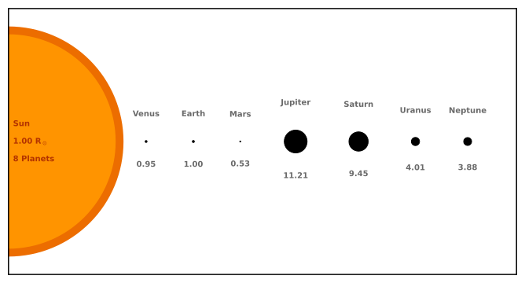

# Visualising Exoplanet Parameters
Visualising exoplanet parameters with time (as an exercise in creating 
animations and loops). For now, the data set that is read in here comes
from the [Extrasolar Planets Encyclopedia](http://exoplanet.eu/).

      
      

The current state of parameters looks like this:

## System Size Visualisation

Because I like to explore nice ways of visualising data sets, I have also 
explored the comparison of host and planet sizes. In these images, the host 
star disk size is always scaled to unity, while the planet sizes from the 
[NASA EPA](https://exoplanetarchive.ipac.caltech.edu/) are in units of
Earth-radii, but scaled to the size of the stellar disk.

